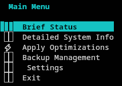

# issues and things to fix / address without necessarily strict order

- bug: icons for main menu entries are not displayed in external to IDE terminal (kitty)
. This should be investigated and fixed. even if caused by some missing font (we should bundle missing assets fonts dependencies if at all possible to avoid relying on user's system configuration)

- app needs to have path autocompletion to improve user experience in TUI mode!

- verbosity levels should be standard: fatal, error, warn, info, debug, trace. Default for development should be debug, for production should be info.

- functionality should be added to configure path for application data, config files, (for log files and backups it is already configurable).

- it should be possible to add multiple paths for backups, with clearly indicated and marked primary path which will be used to save new backups by default and indicating to user what non primary paths will be used only for locating backups for restoration.

- CRITICAL: currently app in TUI mode will not go into some submenus (in particular "Brief Status" and "Detailed System Info") - this most probably is caused by waiting for data to be loaded. We should go into submenus immediately and load data in background, showing some indicator that data is being loaded. This is indication of poor decoupling between TUI and backend. Proper solution would be to achieve full decoupling of TUI and backend, so that TUI can navigate freely and backend can load data in background without blocking UI. In case of showing dynamic data (like cpu gpu temp load etc) decoupled properly working app should continuously and asynchronously update data in background without blocking UI.
 In General UI (TUI currently but in future maybe also GUI and or WebUI) should be fully decoupled from backend. THIS IS VERY IMPORTANT!

- CRITICAL: resize of terminal window should be properly detected and content should be repainted accordingly. This is not working properly in current version. TUI part of app should detect resizes and repaint. App should also handle cases when terminal window is resized while some data is being loaded. TUI should be responsive and dynamic.
 - BUG: currently resizing of terminal into smaller one will cause data to be cut off and not repainted properly. This should be fixed. at all pages in TUI we should support vertical scroll, horizontal scroll (optional, can be enabled by user from settings menu) and proper repainting on resize.